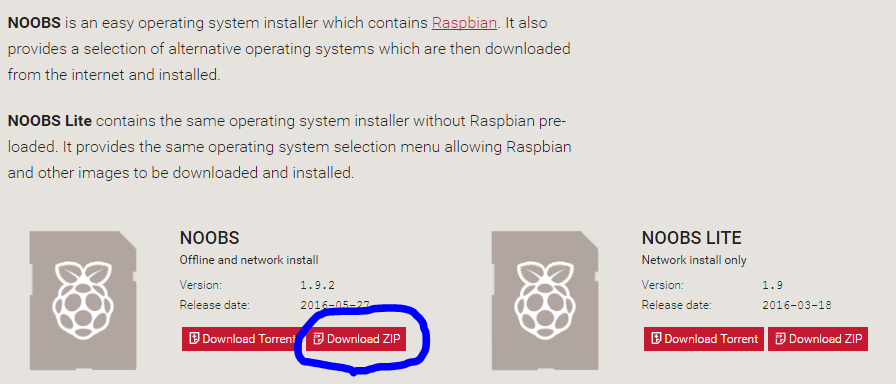
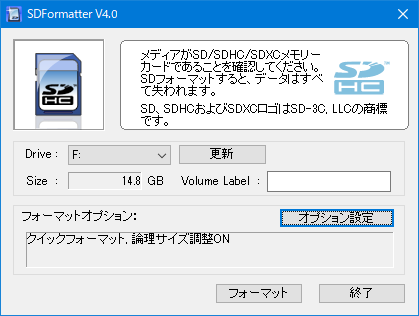
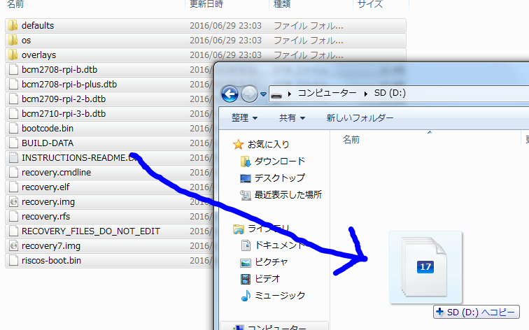

# 1.作業内容
1. OSをダウンロード
1. SDカードのフォーマッターをダウンロードしてパソコンにインストール
1. マイクロSDをフォーマット
1. マイクロSDにOSを書き込む
1. USB機器をRaspberry Piに接続して電源入れる
1. OSインストール実行
1. デスクトップ画面の表示確認

# 2.OSをダウンロード
[Raspberry Piの公式サイト](https://www.raspberrypi.org/downloads/noobs/)からNOOBSのDownloadZIPをクリック。
 

# 3.SDカードのフォーマッターをパソコンにインストール
tool/SDFormatterv4/setup.exeを実行する

# 4.マイクロSDをフォーマット
SDFormatterを起動してSDカードをフォーマットする。  
オプションを変更して論理サイズ調整をONにする。
 

# 5.マイクロSDにOSを書き込む
エクスプローラーでコピー
 

# 6.USB機器をRaspberry Piに接続して電源入れる
マイクロUSBつなぐだけ

# 7.OSインストール実行
Raspbianを選択してインストール  
画面下部の言語設定を日本語に変える
